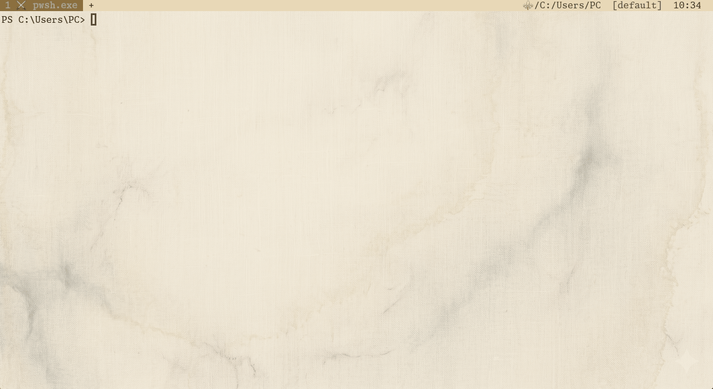
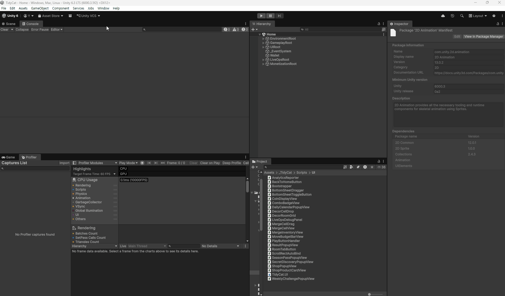
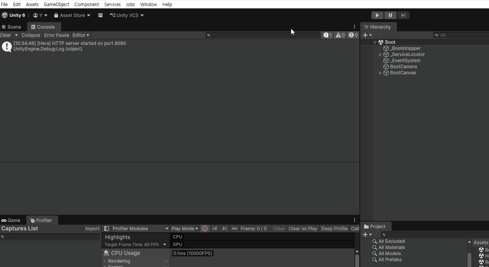
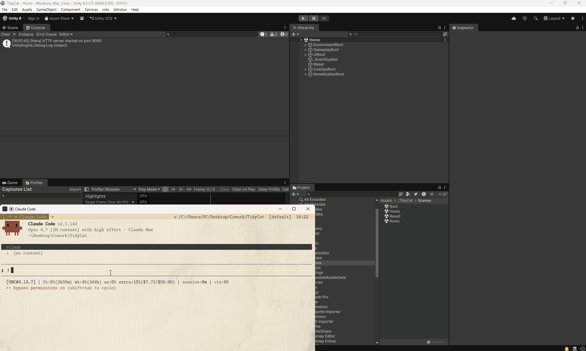

<div align="center">


<br>

[](https://github.com/NotNull92/hera-agent/releases)
[](LICENSE)
[](https://go.dev)
[]()

**Measurement, not guessing — give AI hands on the live Editor.**

<br><br>

**Install → Connect → Let AI drive Unity**



<br><br>

**UPM Package Installation**



<br><br>

**Check Unity Connection**



<br><br>

**Claude Code + hera-agent Scene Transition**



<br><br>

[Installation](#installation) · [Quick Start](#quick-start) · [Commands](#commands) · [Custom Tools](#custom-tools) · [Architecture](#architecture)

</div>

---

## Hera

LLMs don't know your project. They remember last year's Unity API and generalized patterns. You pay that gap every week — in tokens and in time.

Hera stands between them.

Before AI guesses your code, Hera runs it in the Editor and returns the result. Before AI assumes a console error, Hera fetches the actual log filtered by type. Before AI hypothesizes a Play Mode outcome, Hera enters it and waits until it finishes.

No middleware. No Python, no WebSocket, no JSON-RPC. One Go binary, localhost HTTP, one C# UPM package. When Unity Editor opens, Hera is already there.

Hera responds to commands — never inferring, never assuming. It returns what your Unity is, right now, exactly as it is.

Guessing is expensive. Measurement is the command.

```
┌─────────────┐      HTTP      ┌─────────────────┐
│   Terminal  │ ◄────────────► │   Unity Editor  │
│  (1 binary) │   port 8090    │ (auto-starts)   │
└─────────────┘                └─────────────────┘
```

**~2,600 lines of core Go. ~3,900 lines of C#. Nothing else.**

> Tests, TUI, and asset-config layer add ~2,300 more lines — but the engine that talks to Unity stays lean.

---

## Installation

**macOS / Linux**
```bash
curl -fsSL https://raw.githubusercontent.com/NotNull92/hera-agent/main/install.sh | sh
```

**Windows** (PowerShell)
```powershell
irm https://raw.githubusercontent.com/NotNull92/hera-agent/main/install.ps1 | iex
```

<details>
<summary>Other installation methods</summary>

**`go install`** (any platform)
```bash
go install github.com/NotNull92/hera-agent@latest
```

**Manual** — grab the binary from [Releases](https://github.com/NotNull92/hera-agent/releases) for your platform.

</details>

---

## Quick Start

### 1. Install the Unity Connector

**Package Manager → Add package from git URL**
```
https://github.com/NotNull92/hera-agent.git?path=AgentConnector
```

Or add to `Packages/manifest.json`:
```json
"com.notnull92.hera-agent": "https://github.com/NotNull92/hera-agent.git?path=AgentConnector"
```

> The connector starts automatically. No configuration.

### 2. Run Commands

```bash
# Is Unity even connected? (no port-finding ceremony)
hera-agent status

# Drive Play Mode from your terminal — wait until it's actually in
hera-agent editor play --wait

# Run any C# directly inside Unity — no recompile, no restart
hera-agent exec "return EditorSceneManager.GetActiveScene().name;"

# Read errors AI can act on, not screenshots
hera-agent console --type error
```

### 3. Let your AI agent take over

**Discover** — open Claude Code CLI in any terminal and ask:

> **"Check whether the hera-agent CLI tool is installed and explore its capabilities."**

The agent will discover hera-agent, list its commands, and start driving Unity for you.

#### AI Agent Compatibility

hera-agent is a plain CLI returning JSON, so any coding agent capable of running shell commands can drive it:

| Tool | Project rules file |
|------|--------------------|
| **Claude Code CLI** | `CLAUDE.md` (project root) |
| **OpenAI Codex** | `AGENTS.md` (project root) |
| **Cursor** | `.cursor/rules/hera-agent.mdc` |
| **GitHub Copilot** | `.github/copilot-instructions.md` |
| **Continue.dev** | `.continuerules` |
| Other | whatever your tool calls its project rules file |

#### Set up agent rules (one time per project)

Two pieces of guidance to add — both **strongly recommended**:

**1. Tell the agent to reach for hera-agent first.** Add to your project rules file:

> **"For any Unity work, always use hera-agent as the first choice."**

Without this, agents guess Unity APIs from training data instead of probing the live editor — outdated code, wrong assumptions, wasted tokens.

**2. Give the agent the usage guide.** Two options:

- **Full guide** — copy [`AGENT.md`](AGENT.md) (rules, cookbook, pitfalls, reference) into your project rules file, or `@include` / `@import` it if your tool supports remote references.
- **Lean subset** — for a smaller token footprint, pipe the Quick Rules + Pitfalls into your rules file via the CLI:

  ```bash
  # bash / zsh
  hera-agent doctor --agent-rules >> CLAUDE.md      # Claude Code
  hera-agent doctor --agent-rules >> AGENTS.md      # Codex
  hera-agent doctor --agent-rules >> .cursor/rules/hera-agent.mdc   # Cursor

  # PowerShell (Windows)
  hera-agent doctor --agent-rules | Out-File -Append CLAUDE.md
  ```

  This emits a 1–2 KB subset of [`AGENT.md`](AGENT.md) covering the must-follow rules and the common pitfalls. Skip Reference / Cookbook to keep per-session token cost low.

---

## Commands

| Command | What it does |
|---------|-------------|
| `editor` | Play, stop, pause, refresh |
| `exec` | Run arbitrary C# inside Unity (`--file <path>` for long code, `--depth N` to scope response) |
| `log` | Write to Unity console without csc compile cost |
| `ping` | Token-cheap liveness probe (heartbeat read only, no HTTP) |
| `scene` | Info, load, save, list, close |
| `console` | Read, filter, clear logs |
| `test` | Run EditMode / PlayMode tests |
| `menu` | Execute any menu item by path |
| `screenshot` | Capture scene or game view |
| `profiler` | Read hierarchy, toggle recording |
| `reserialize` | Fix YAML after text edits |
| `list` | Slim default; `--names` / `--tool <name>` for token-efficient introspection |
| `status` | Connection & project info |
| `doctor` | Self-diagnose PATH, installs, shell, Unity reachability (`--json` for agents) |
| `asset-config` | Toggle optional asset integrations (TUI / list / enable / disable / detect / `--json`) |
| `update` | Self-update the binary |
| `uninstall` | Remove the CLI from PATH |

Stuck? Run `hera-agent doctor`, or see [docs/TROUBLESHOOTING.md](docs/TROUBLESHOOTING.md).

---

## The `exec` Command

The most powerful feature. Full runtime access. Zero boilerplate.

```bash
# Inspect anything
hera-agent exec "return World.All.Count;" --usings Unity.Entities

# Modify the scene
hera-agent exec "var go = new GameObject(\"Temp\"); return go.name;"

# Pipe complex code via stdin (no shell escaping)
echo '
var scene = EditorSceneManager.GetActiveScene();
return scene.GetRootGameObjects().Length;
' | hera-agent exec
```

Because it compiles and runs real C#, you can call **any** Unity API, inspect ECS worlds, modify assets, or invoke internal editor utilities. No custom tool needed.

---

## Custom Tools

Drop a C# class anywhere in your Editor assembly. It is discovered automatically.

```csharp
using HeraAgent;
using Newtonsoft.Json.Linq;

[HeraTool(Name = "spawn", Group = "gameplay")]
public static class SpawnEnemy
{
    public class Parameters
    {
        [ToolParameter("X position", Required = true)] public float X;
        [ToolParameter("Y position", Required = true)] public float Y;
        [ToolParameter("Z position", Required = true)] public float Z;
        [ToolParameter("Prefab name", DefaultValue = "Enemy")] public string Prefab;
    }

    public static object HandleCommand(JObject args)
    {
        var p = new ToolParams(args);
        var prefab = Resources.Load<GameObject>(p.Get("prefab", "Enemy"));
        var inst = Object.Instantiate(prefab, new Vector3(p.GetFloat("x"), p.GetFloat("y"), p.GetFloat("z")), Quaternion.identity);
        return new SuccessResponse("Spawned", new { name = inst.name });
    }
}
```

Call it:
```bash
hera-agent spawn --x 1 --y 0 --z 5 --prefab Goblin
```

`hera-agent list` exposes parameter schemas so AI assistants can discover and call your tools without reading source code.

---

## Architecture

```
┌─────────────┐         ┌─────────────────────────────┐
│   CLI Go    │         │      Unity Editor           │
│  (~2.6k LoC core) │◄──────►│  ┌─────────────────────┐    │
│             │  HTTP   │  │   HttpServer        │    │
│ • discovers │  8090+  │  │   (localhost)       │    │
│ • sends cmd │         │  └──────────┬──────────┘    │
│ • prints    │         │             │ reflection     │
│   response  │         │  ┌──────────▼──────────┐    │
└─────────────┘         │  │   [HeraTool]        │    │
                        │  │   classes           │    │
                        │  └─────────────────────┘    │
                        └─────────────────────────────┘
```

- **Stateless** — every request is independent. No reconnection dance.
- **Auto-discovery** — scans `~/.hera-agent/instances/` to find open Unity editors.
- **Domain-reload safe** — connector survives script recompilation and resumes automatically.
- **Main-thread execution** — all tool handlers run on Unity's main thread. Every API is safe.

---

## Compared to MCP

| | MCP Integrations | hera-agent |
|---|:---:|:---:|
| **Install** | Python + uv + FastMCP + config | Single binary |
| **Runtime deps** | WebSocket relay, persistent process | None |
| **Protocol** | JSON-RPC 2.0 over stdio | Direct HTTP POST |
| **Setup** | Generate config, restart AI client | Add package, done |
| **Domain reload** | Complex reconnect logic | Stateless |
| **Custom tools** | `[Attribute]` pattern | Same `[Attribute]` pattern |
| **Compatibility** | MCP clients only | Any shell / any agent |

---

## Global Flags

```bash
--port <N>       # Select Unity instance by active heartbeat port
--project <path> # Select Unity instance by project path
--timeout <ms>   # Request timeout in ms (default: 60000)
--verbose        # Print progress + per-phase timings to stderr
```

---

## Author

**Victor** — Unity/C# Developer, 6+ years live-service MMORPG production  
Building [NoMoreRolls](https://github.com/NotNull92) solo with [hera-agent](https://github.com/NotNull92/hera-agent) · [IndieAlchemist](https://www.youtube.com/@IndieAlchemist) on YouTube

[](https://github.com/NotNull92)
[](mailto:fatiger92@gmail.com)

## License

MIT
